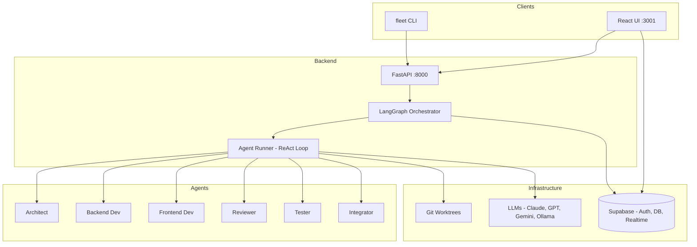
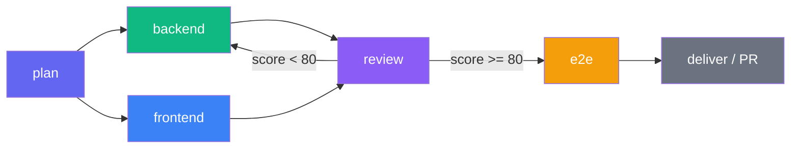

# Agent Fleet

[](https://www.python.org/)
[]()
[](LICENSE)
[](https://supabase.com)

Multi-model AI agent orchestration platform. Submit a coding task, and specialized agents collaborate through quality gates to produce a pull request.

Built on **LangGraph + LiteLLM + FastAPI + Supabase + React**.

## Architecture



## Pipeline



## Features

| Feature | Description |
|---------|-------------|
| **Multi-model** | Any LLM via LiteLLM — Claude, GPT, Gemini, Ollama (local) |
| **6 Built-in Agents** | Architect, Backend Dev, Frontend Dev, Reviewer, Tester, Integrator |
| **Quality Gates** | Automated (pytest), Score (reviewer JSON 0-100), Approval |
| **Parallel Execution** | Stages with same dependencies run concurrently |
| **Git Worktree Isolation** | Each agent gets its own workspace |
| **Score Gate Route-back** | Reviewer identifies which stage needs fixes |
| **Agent Chatbot** | Conversational interface to any agent with streaming |
| **Project Onboarding** | `fleet init` scans codebase, recommends agents + workflow |
| **Pluggable PR Creation** | GitHub, GitLab, or local summary |
| **API Key Management** | Encrypted storage, per-user, test connectivity |
| **React Dashboard** | 10 pages — KPIs, task monitor, agent builder, workflow designer, chat |
| **Docker Setup** | One command: `./setup.sh` |

## Quick Start

```bash
git clone https://github.com/pkanduri1/agent-fleet.git
cd agent-fleet
./setup.sh    # Starts everything in Docker
```

**Access:**
| Service | URL |
|---------|-----|
| Frontend | http://localhost:3001 |
| Backend API | http://localhost:8000 |
| Supabase Studio | http://localhost:54323 |

**Default login:** `admin@agentfleet.local` / `agentfleet123`

## Manual Setup

```bash
python3.12 -m venv .venv && source .venv/bin/activate
pip install -e ".[dev]"
cd fleet-ui && npm install && cd ..
supabase start && supabase db push --local
uvicorn agent_fleet.main:app --reload --port 8000  # Terminal 1
cd fleet-ui && npm run dev                          # Terminal 2
```

## Tech Stack

| Layer | Technology |
|-------|-----------|
| Orchestration | LangGraph (state graph, conditional edges) |
| LLM Access | LiteLLM (100+ models, unified API) |
| Backend | FastAPI + Python 3.12 |
| Frontend | React 18 + MUI + React Flow |
| Database | Supabase (Postgres + Auth + Realtime + Storage) |
| CLI | Typer |
| Design System | Flat Design, Indigo #6366F1, Fira Code/Sans |
| Testing | pytest (292) + Playwright (45) = 337 tests |

## Documentation

| Guide | Description |
|-------|-------------|
| [Setup Guide](docs/setup.md) | Prerequisites, install, Supabase config |
| [CLI Reference](docs/cli.md) | All fleet commands with examples |
| [UI Guide](docs/ui.md) | Page-by-page walkthrough |
| [API Reference](docs/api.md) | All REST endpoints with curl examples |
| [Architecture](docs/architecture.md) | System design, data flow diagrams |
| [Agent Config](docs/agents.md) | YAML schema, built-in agents, custom agents |
| [Workflow Config](docs/workflows.md) | Pipeline stages, gate types, tuning |
| [Chat Guide](docs/chat.md) | Chatbot usage, agent capabilities |
| [Docker & Deployment](docs/docker.md) | Docker setup, troubleshooting, production |
| [Security](docs/security.md) | Auth, encryption, RLS policies |
| [Onboarding](docs/onboarding.md) | fleet init, scanner, recommendations |
| [Admin Guide](docs/admin.md) | API keys, user management, monitoring |
| [Contributing](docs/contributing.md) | Dev setup, testing, conventions |

## License

MIT
