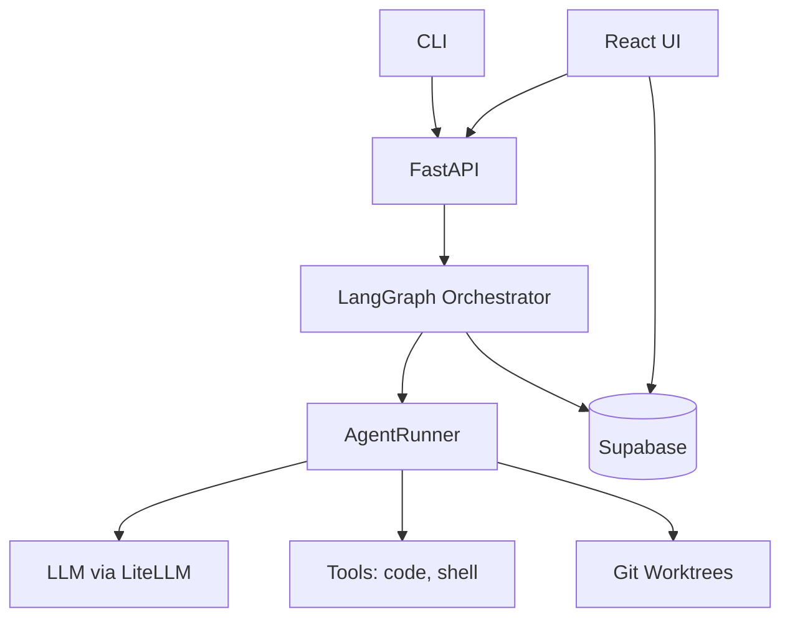
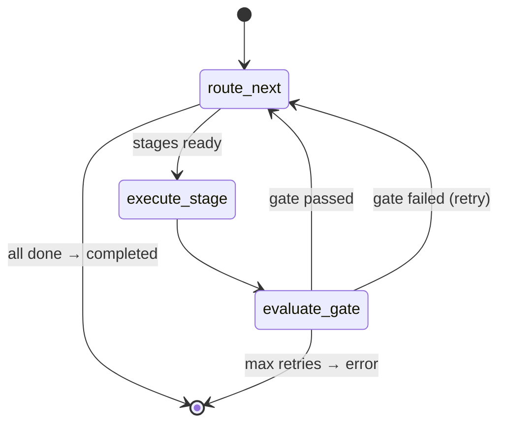
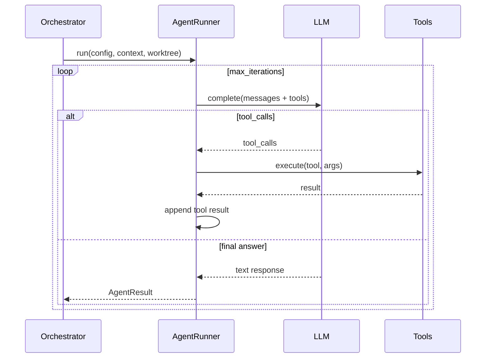
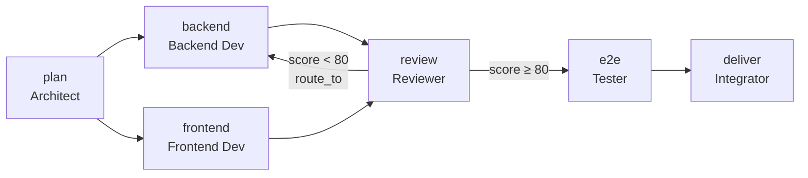
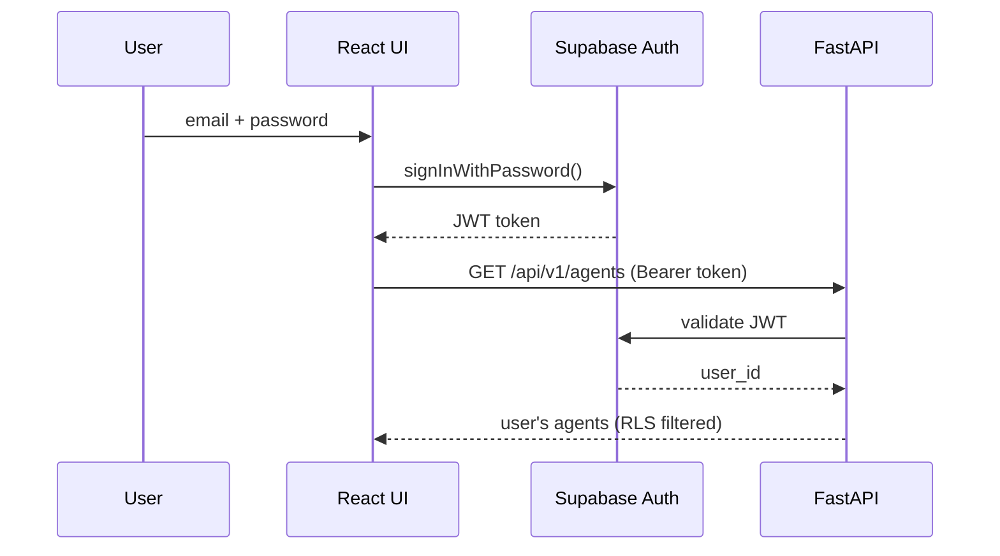
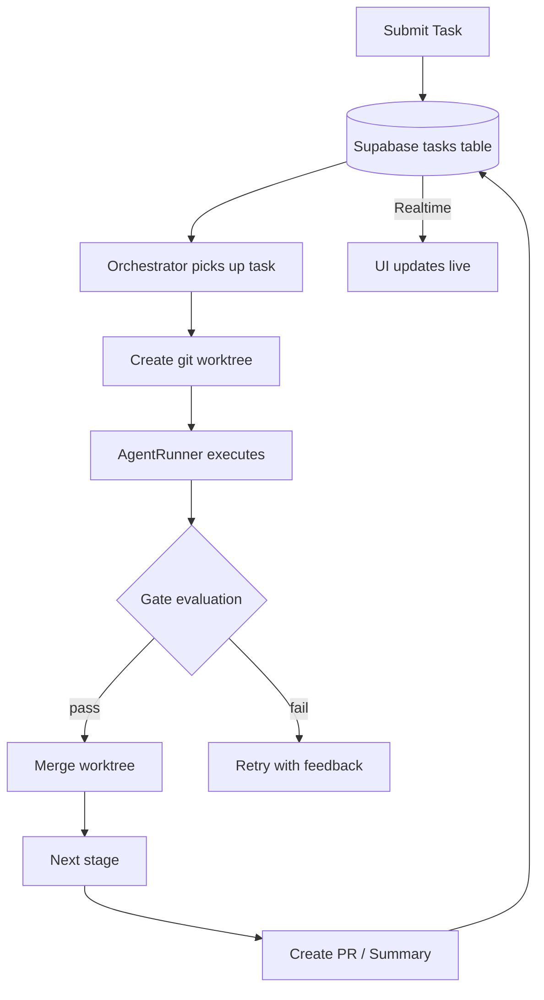

# Architecture Guide

## System Overview

## Orchestrator State Machine

## Agent ReAct Loop

## Pipeline Flow

## Auth Flow

## Data Flow

## Key Design Decisions

| Decision | Choice | Why |
|----------|--------|-----|
| Orchestrator | LangGraph | Conditional edges, checkpointing, parallel branches |
| LLM access | LiteLLM | 100+ models, unified API, no vendor lock-in |
| Agent pattern | ReAct loop | Standard for coding agents (OpenHands, SWE-agent) |
| Isolation | Git worktrees | Lightweight, no Docker overhead, real git history |
| Database | Supabase | Auth + DB + Realtime + Storage in one |
| Score gate | Reviewer JSON | Agent specifies route_to target, not hardcoded |
